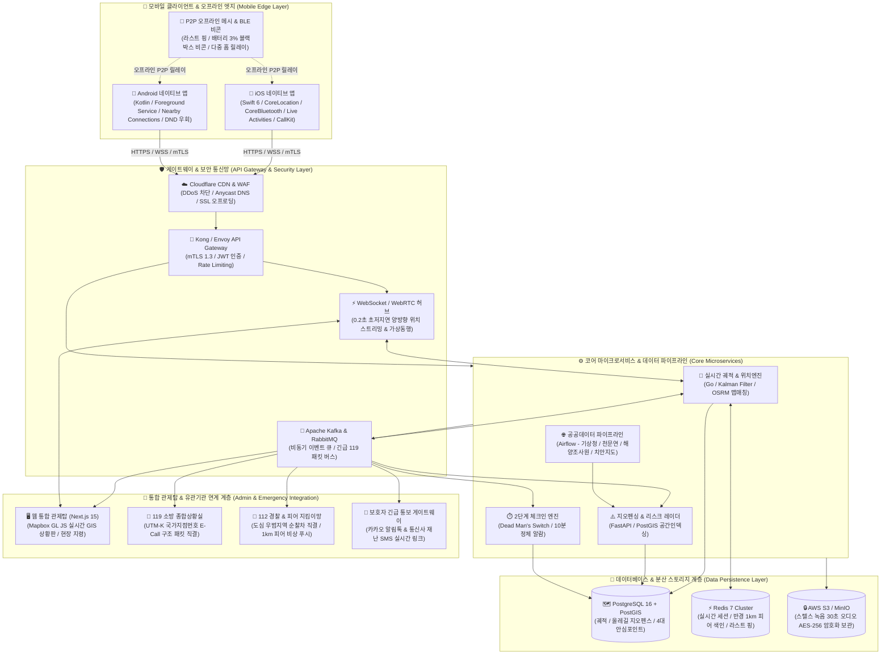

# 스마트 제주 트래블 가디언 (SMART JEJU TRAVEL GUARDIAN) 🛡️

> **제주 및 전국 단독·안심 여행자를 위한 4대 안전영역 & 16대 전방위 스마트 세이프티 & 긴급 구난 통합 플랫폼**

자연재해·조난부터 도심 범죄·신변 위협, 모빌리티 및 숙소 안전까지, **상시 감시의 거부감은 지우고 단독 여행자의 위기 골든타임을 지키는 실시간 통합 수호 솔루션**입니다.

---

## 🌟 4대 영역 16대 핵심 안전 체계

### 1. 사전 위험 예방 레이더 (Prevention Radar)
1. **공공기관 데이터 실시간 연동**: 기상청 날씨/특보, 한국천문연구원 일출·일몰 시간(당일 일몰 30분 전 산악 하산 권고), 국립해양조사원 만조 데이터(만조 40분 전 해안 갯바위 대피 경보)
2. **범죄다수 발생지역 지오펜싱**: 경찰청 치안통계 및 지자체 범죄지도 연계, 우범지대 및 가로등 취약 골목 진입 시 햅틱 진동 및 안전 우회로 권고
3. **여성안심귀갓길 & 5대 범죄 밀집도 지오펜스**: 행정안전부·국립재난안전연구원 ‘생활안전지도(Safemap)’ OpenAPI 연계, 야간 조도 취약지 및 5대 범죄 통계 주의구역 접근 시 햅틱 경고 및 여성안심귀갓길 우회로 실시간 안내 (아청법 리스크 원천 차단)
4. **숙소 안심 점검 & 불법촬영 탐지**: 카메라 IR 적외선 센서를 이용한 몰카 렌즈 탐지 가이드 및 Wi-Fi 비인가 IP 카메라 스캐닝

### 2. 지능형 모니터링 & 조난 차단 (Smart Monitoring)
5. **단독여행자 실시간 궤적추적**: 올레길·등산로 브레드크럼(Breadcrumb) 이동 궤적 실시간 기록, 코스 이탈 자동 감지
6. **2단계 체크인 (데드맨 스위치)**: 위험구역 10분 정체 시 본인 확인(진동/화면탭/음성) ➔ 3분간 무응답 시에만 비상 전파로 **오경보 90% 차단**
7. **라스트 핑 & 라스트 블랙박스 비콘**:
   - 통신 음영 직전 좌표 서버 박제 + 배터리 3% 방전 직전 최소전력 BLE 비콘 방출로 수색 드론/수색견 탐지 유도
   - **iOS 구현/회피:** `ActivityKit` 킵얼라이브 연동, 셧다운 전 고전력 GPS 차단 ➔ iBeacon 초절전 펄스 전환(3~5시간 지속)
   - **Android 구현/회피:** `Foreground Service` Doze 방어, `Nearby Connections API` P2P 클러스터 메시, 3% 시 비연결형 BLE 패킷(좌표/혈액형) 브로드캐스팅
8. **야생동물 출몰 경보 & 기피 주파수**: 제주 중산간 들개 무리, 멧돼지 출몰지 경고 및 20kHz~25kHz 고주파 사운드 방출

### 3. 위기 대응 & 탈출 (Crisis Response & Escape)
9. **주머니 속 스텔스 무음 SOS**: 화면을 켜지 않고 주머니 속에서 전원버튼 5회 클릭 ➔ 30초 현장 오디오 자동 녹음 및 실시간 좌표 112/보호자 은밀 전송
10. **AI 가짜 통화 & 가상 동행**: 어두운 밤길에서 "누군가와 통화 중"인 상황을 연출하는 AI 음성 가짜 통화 실행 및 보호자 실시간 위치 중계
11. **강제 최대 볼륨 비상 사이렌**: 매너모드/진동 상태 강제 해제, 120dB급 소방/경찰 주파수 변조 사운드(Web Audio API) 및 화면 스트로브 플래시 점멸
12. **여행자 안심포인트 & 최단 대피로**: 학교지킴이집, 24시 안심편의점, 주유소, 지구대/파출소 위치 및 비상 시 원터치 최단 도보 내비게이션 연동
13. **인근 병원 및 응급의료 안내**: 야간/휴일 진료 병·의원, 권역 응급의료센터, 공공 심장충격기(AED) 핀포인트 안내 및 원클릭 응급실 직통 연결

### 4. 모빌리티 & 커뮤니티 연대 (Mobility & Community)
14. **피어(동서비스 이용자) SOS**: 반경 1km 내 동일 앱 이용자 및 등록된 로컬 지킴이(주민, 상인)에게 즉각 긴급 푸시 전파
15. **모빌리티 세이프티**: 택시 권장경로 20% 이상 이탈 시 자동 경고 & 렌터카 전복·충격 감지 자동 e-Call
16. **올레길 안심 동행 매칭 & 다국어 119 TTS**: 본인인증 1인 여행자 간 안전 버디 매칭 및 외국인 관광객을 위한 다국어 한국어 음성 번역 리포트

---

## 🏗️ 전체 시스템 구조도 (System Architecture)



---

## 📂 프로젝트 구성

공개 배포되는 정적 산출물은 **`public/` 디렉터리에만** 두고, 문서·설정·스크립트는 리포지터리 루트에 둡니다. (배포 시 명세서·작업지시서가 공개 URL로 노출되는 것을 방지)

```
public/                  # ← 정적 배포 대상 (Vercel outputDirectory / Wrangler assets)
├── index.html           # 1차 제안서 — 18장 인터랙티브 덱
├── doc/index.html       # 제출용 사업제안서 (A4 인쇄본) ★ 도청 제출 정본
├── v2/index.html        # 제안서 v2 — 19장 (기술 실현성 검증 반영) · 시연용
├── review/index.html    # 기술 실현성 판정 보고서 — 49개 항목 스크롤형 원장
├── review-deck/         # 기술 실현성 판정 덱 — 14장
└── assets/              # 덱에서 참조하는 이미지 리소스
vercel.json              # Vercel 정적 호스팅 + 보안 헤더(CSP 등) 설정
wrangler.toml            # Cloudflare Workers Static Assets 배포 설정
scripts/                 # 에셋 생성 등 개발용 스크립트 (배포 제외)
README.md
TECHNICAL_SPEC.md        # 공식 엔지니어링 명세서
GEMINI_TASK_PROMPT.md    # 개선 작업 지시서
```

### 배포 문서 5종

| 경로 | 문서 | 내용 |
|---|---|---|
| `/` | **공개본 제안서** (19장) ★ | **도메인 주소로 바로 보이는 대외 공개 화면.** 내부 검토가 끝난 것만 여기에 올립니다. |
| **`/doc/`** | **제출용 사업제안서** (A4) ★ | **도청 제출 정본.** 행정 문서 형식. 예산 산출, 추진체계, 중복 검토, 성과지표·종료조건, 법령·책임 검토를 담았습니다. |
| `/v2/` | **내부 작업본** | **수정은 여기서 합니다.** 검토가 끝나 대외 공개할 시점이 되면 `/` 로 올립니다. |
| `/review/` | 실현성 판정 보고서 | 16대 기능을 49개 구현 단위로 분해해 가능(23)·조건부(15)·불가능(11) 판정. 판정별 필터 제공 |
| `/review-deck/` | 실현성 판정 덱 (14장) | 위 판정 결과의 발표용 요약본 |

### 공개본과 내부 작업본을 나눈 이유

대외 공개 화면(`/`)과 작업 중인 화면을 같은 주소에 두면, 고치는 도중에
담당자가 들어와 미완성 문장을 보게 됩니다. 그래서 이렇게 나눕니다.

| | 수정 | 대외 공개 |
|---|---|---|
| `/v2/` 내부 작업본 | **여기서 합니다** | 하지 않음 |
| `/` 공개본 | 하지 않음 | **여기가 공개 화면** |

```bash
# 내부 검토가 끝나 대외 공개할 시점에만 실행합니다
cp public/v2/index.html public/index.html
```

`./scripts/verify-deploy.sh` 가 두 경로의 내용을 대조해, **내부에서 고쳐 놓고
공개본에 올리는 것을 잊은 상태**를 알려줍니다.

- `public/index.html` · `public/v2/index.html`: 같은 19장 구성. 3번 슬라이드가
  검증으로 교정한 항목, 15번이 OS 제약 매트릭스, 17번이 관제 기능 명세,
  마지막이 WBS 공수 산정(**58MM / 12개월**)입니다.
- 1차 제안서(18장)는 2026-09-21 에 공개본에서 내렸습니다. 내용이 교정 전
  기준이라 대외 공개가 오해를 부르기 때문입니다. **git 이력에 그대로 남아
  있습니다** — `git show <이 커밋 직전>:public/index.html`
- `TECHNICAL_SPEC.md`: 모바일 네이티브(iOS/Android), 백엔드, 웹 관제탑, OS별 기술적·법적 제약, 개발 WBS 및 공수 산정, 오경보 KPI, 운영비(TCO), 경쟁 분석, 개인정보 영향평가(PIA)가 명시된 공식 엔지니어링 명세서

> ⚠️ **문서 간 기준 차이**
> 본 README의 아래 &lsquo;4대 영역 16대 핵심 안전 체계&rsquo; 및 `TECHNICAL_SPEC.md`는 **1차 제안 기준**으로 작성되어 있습니다.
> 전원키 트리거, 120dB 사이렌, 초음파 기피, LiDAR 핀홀 검출, 119 시스템 직결, 32MM/6개월 공수 등
> **기술 검증에서 교정된 항목은 `/` · `/v2/` 및 `/review/`가 최신 기준**입니다.
>
> 그리고 **도청에 제출하는 정본은 `/doc/`** 입니다. 예산·추진체계·중복검토·성과지표 등
> 행정 검토 항목은 `/doc/` 에만 있으며, 대외 제출 시 기준이 되는 문서는 `/doc/` 하나입니다.

---

## 🚀 실행 및 배포 방법

### 1. 로컬에서 실행
로컬 웹서버로 실행합니다. (`npx serve public` 또는 `python3 -m http.server -d public`)

| 로컬 주소 | 문서 |
|---|---|
| `http://localhost:3000/` | 1차 제안서 |
| `http://localhost:3000/doc/` | **제출용 사업제안서 (정본)** |
| `http://localhost:3000/v2/` | 제안서 v2 (시연용) |
| `http://localhost:3000/review/` | 판정 보고서 |
| `http://localhost:3000/review-deck/` | 판정 덱 |

**제안서 v2 (`/v2/`) 슬라이드 안내**
- 키보드 [←], [→], [Space], [PageUp/PageDown], [Home/End] 또는 하단 고정 플로팅 바로 19개 슬라이드 이동
- **슬라이드 3**: v2 개정 요지 — 1차 대비 변경 대조표 (발표 시 첫 질문에 대한 답)
- **슬라이드 12**: 라이브 시뮬레이터 — 사이렌, 무음 SOS, AI 가짜 통화, 야생동물 대응음, 택시 경로이탈 등 직접 체험
- **슬라이드 15**: OS별 재검증 결과 9행 매트릭스 (붉은 글씨가 v2 정정 항목)
- **슬라이드 18~19**: 58MM / 12개월 재산정 공수표 및 Phase 1/2/3 로드맵

### 1-1. 편집 가능한 문서 만들기

제출 정본(`public/doc/index.html`)을 편집 가능한 파일로 찍어냅니다.

```bash
python3 scripts/make_docx.py    # build/제안서.docx  (Word · 한글 모두 편집 가능)
./scripts/make_pdf.sh           # build/제안서.pdf   (인쇄·제출용)
```

**HTML 이 정본입니다.** 내용을 고칠 일이 생기면 `public/doc/index.html` 을 고치고
위 명령을 다시 돌립니다. docx·pdf 를 직접 고치면 정본과 어긋납니다.

외부 패키지를 쓰지 않습니다(표준 라이브러리 `zipfile` 로 OOXML·OWPML 직접 작성).
`.hwpx` 는 만들지 않습니다. 한글에서 편집해야 하면 `.docx` 를 열어 저장하십시오 —
형식이 둘로 갈리면 어느 쪽이 최신인지 알 수 없게 됩니다.
PDF 는 정본 HTML 과 같은 엔진(Chrome)으로 뽑아 화면과 쪽 나눔이 일치합니다.

### 2. Vercel 배포 (권장)
GitHub 저장소를 Vercel에 연동하면 `public/` 디렉터리(`vercel.json`의 `outputDirectory`)가 전 세계 글로벌 CDN을 통해 정적 웹사이트로 자동 배포됩니다.

빌드 단계에서 `scripts/inject-version.sh`가 배포 커밋 해시를 `public/version.json`으로 떨굽니다.

### 2-1. 배포 확인 — 반드시 커밋으로 대조

```bash
./scripts/verify-deploy.sh
```

배포본이 알려주는 커밋을 `origin/main`과 대조하고, 공개 페이지 4종의 응답을 확인합니다.
불일치면 실패(exit 1)로 끝냅니다.

**"정상 응답(200)"만 보는 확인은 확인이 아닙니다.** 개발 브랜치에만 병합하고 배포
푸시를 빠뜨려도 이전 배포본이 계속 200을 돌려주기 때문입니다.

```
== 배포 확인 (https://jeju-travel-guardian.vercel.app) ==
  ✓ 커밋 일치 f75f517a  (빌드 2026-09-20T02:56:53Z)
  ✓ / (200)
  ✓ /v2/ (200)
  ✓ /review/ (200)
  ✓ /review-deck/ (200)
== 배포 확인 통과 ==
```

### 3. Cloudflare Pages / Workers Static Assets 배포 (선택)
Cloudflare Pages에 Git 리포지토리를 연결하거나, `wrangler.toml`을 통해 `npx wrangler deploy`를 실행하면 `public/` 디렉터리가 Cloudflare 글로벌 엣지 네트워크에서 정적 자산으로 직접 서빙됩니다. (기존 98KB 문자열 복제 방식의 `worker.js`를 폐기하고 원본 직접 서빙 체계로 전환하여 항상 최신 본문과의 100% 일치를 보장합니다.)
---

## 🌐 연동 정부 및 민간 OpenAPI 명세 (OpenAPI Registry)

본 플랫폼은 위기 예방 및 실시간 구난을 위해 정부 및 민간의 핵심 OpenAPI를 실시간 연동합니다.

| 연동 서비스명 | 제공 기관 / 기업 | 엔드포인트 / 서비스 URL | 주요 기능 | 인증 방식 |
|---|---|---|---|---|
| **기상특보 & 단기예보** | 기상청 (KMA) | `data.go.kr/1360000/VilageFcstInfoService_2.0` | 호우/강풍/대설 특보 및 시간별 강수 확률 | 공공데이터포털 일반 인증키 |
| **일출·일몰 영력정보** | 한국천문연구원 (KASI) | `data.go.kr/B090041/RiseSetInfoService` | 위치 기반 당일 일몰시각 산출 (일몰 30분 전 하산 권고) | 공공데이터포털 일반 인증키 |
| **바다누리 조석예보** | 국립해양조사원 (KHOA) | `khoa.go.kr/api/oceangrid/tideObsPreTab` | 고조(만조) 시각 산출 (만조 40분 전 갯바위 대피 경보) | 해양정보포털 ServiceKey |
| **생활안전지도 (Safemap)** | 행정안전부 / 국립재난안전연구원 | `safemap.go.kr/openApi` | 치안 5대 범죄 밀집도 WMS 레이어 및 여성안심귀갓길 폴리곤 | Open API Key |
| **응급실 실시간 가용병상** | 국립중앙의료원 (E-Gen) | `data.go.kr/B552657/ErmctInfoInqireService` | 제주대병원/한라병원 실시간 중환자실/응급실 가용병상 | 공공데이터포털 일반 인증키 |
| **공공 자동심장충격기(AED)** | 국립중앙의료원 (E-Gen) | `data.go.kr/B552657/AedInfoInqireService` | 반경 200m 내 공공 AED 비치함 실시간 핀포인트 안내 | 공공데이터포털 일반 인증키 |
| **산악 국가지점번호 변환** | 한국국토정보공사 (LX) | `data.go.kr/1611000/nsdi/GisPosService` | WGS84 ➔ UTM-K / 국가지점번호 100km 한글 격자 변환 | 공공데이터포털 일반 인증키 |
| **카카오 로컬 장소검색** | 카카오 (Kakao Developers) | `dapi.kakao.com/v2/local/search/category.json` | 안심편의점(`CS2`), 안심주유소(`OL7`), 병원(`HP8`) 검색 | KakaoAK REST API Key |
| **카카오내비 최적 경로** | 카카오 모빌리티 | `apis-navi.kakaomobility.com/v1/directions` | 택시 권장경로 폴리라인(이탈 판정) 및 도보 대피로 | KakaoAK REST API Key |
| **카카오 알림톡 게이트웨이** | 카카오 비즈메시지 | `api.bizmsg.kr/v2/sender/send` | 보호자 상황별 맞춤 비상 템플릿 및 실시간 궤적 전송 | API Key + Profile Key |
| **119 다매체 긴급신고** | 소방청 종합상황실 | `119.go.kr` 표준 긴급구조 E-Call 인터페이스 | 국가지점번호, 기저질환, 배터리, 암호화 오디오 S3 패킷 | mTLS 상호 인증 |

---

## 🔗 저장소 및 링크
- **GitHub Repository**: [https://github.com/hwansoochoi/jeju-travel-guardian.git](https://github.com/hwansoochoi/jeju-travel-guardian.git)
- **Clone Command**:
  ```bash
  git clone https://github.com/hwansoochoi/jeju-travel-guardian.git
  ```